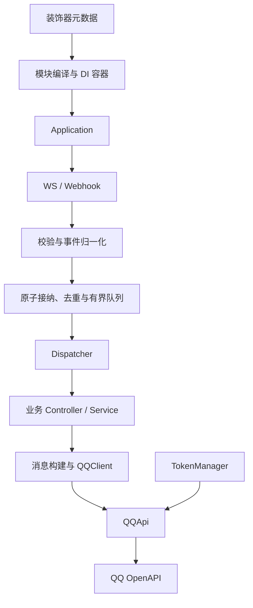

# dd-bot v0.6 详细开发方案

版本：设计契约 1.11（自动附件路由） · 原设计日期：2026-09-30 · 附件与身份补充：2026-10-06

2026-10-01 维护补充：本篇保留设计时的运行时范围和仓库状态；当前源码支持 Node 24.x（最低 24.0.0），开发使用 24.21.0，仓库已公开并合并业务示例与文档。现行安装与 CI 约定以 [仓库维护指南](repository.md) 为准。

本文定义实现目标、模块边界、公开 API、内部接口、失败行为和验收标准。配套的 [public-api.d.ts](./public-api.d.ts) 是设计类型契约；当前 SDK 源码已提供，实际发布声明由 tsc 从源码生成，并通过契约类型检查。本文仍保留目标设计，实际通过项、实现差距和未完成验收见 [验证记录](./validation-report.md)，不能将设计中的每项要求视为已经验证。

工程版本与工具组合另见 [技术选型方案](./technology-selection.md)：TypeScript 按用户要求固定 5.9.3，元数据运行时采用 reflect-metadata/lite。1.2 按用户最新要求移除模板 Markdown/键盘，支持空前缀，补齐实机发现的群聊提及前缀与按钮点击后标签。

1.3 增加显式参数校验、Option、无序 Slot、剩余参数 Rest、可选 HelpModule 与输入错误回复；保留旧 Arg/Args 行为。完整规则与可运行例子见 [命令参数指南](./command-parameters.md)。

1.4 增加可注入 Guard、按用户/会话/命令的进程内冷却、按钮拦截确认、关闭取消与完整业务模块。具体 API 和行为见 [执行控制指南](./execution-controls.md)。

1.5 增加五个内置访问限制装饰器、群消息 memberRole 与群管理者按钮权限。具体类型见 public-api.d.ts，执行规则与输入边界见 [访问限制指南](./access-control.md)。

1.6 增加 MessageContext.prompt、PromptResult、按用户与会话隔离的等待器，以及执行槽挂起/恢复。接口、超时、取消、资源与测试语义见 [二次输入指南](./prompts.md)。

1.7 增加 ModuleMetadata.guards，并支持模块类上的 UseGuards 和内置访问限制。规则按模块、控制器类、方法累加，仅覆盖模块直接注册的控制器，详见 [模块 Guard 指南](./module-guards.md)。

1.8 新增未发布的 Attachments、Images、Videos、Audios、Files 参数装饰器与 AttachmentOptions。它们只选择当前消息顶层附件，在文字绑定之后、冷却之前校验数量，不改变文字消费或旧模式。语音扩展字段只作信息映射；下载、转码和 ASR 执行不属于装饰器。完整语义见 [附件参数](command-parameters.md#附件参数)。其余章节保留原设计的说明与历史范围。

1.9 新增未发布的 User、UserId、Group、GroupId、Role 参数装饰器，以及只读 UserInfo / GroupInfo。命令和按钮共用同步身份绑定；归一化时冻结快照，缺失群或角色时注入 undefined，不查询资料或改变 Guard、参数消费和冷却。Context 接口不变；完整语义见 [身份参数](command-parameters.md#身份参数)。

1.10 根据客户端实测收敛附件交互：保留 Attachments / Images，移除未发布的 Videos / Audios / Files，新增同步 selectAttachments 及分类、选项、结果类型。视频、音频、文件由业务显式 prompt 后筛选；普通数量不符返回 invalid，不自动等待、重试或累计多条消息。分类与数量规则复用，既有命令参数、身份和 prompt 生命周期保持；详见 [附件参数](command-parameters.md#附件参数)。上述 1.8 / 1.9 记录保留当时的设计背景。

1.11 新增未发布的 OnAttachment / OnAttachmentOptions，接收用户直接上传的顶层附件，条件按同一附件取交集。pending prompt 与已识别命令优先，附件路由按现有发现顺序广播；处理器独立授权、冷却、回复及追问生命周期，共享整条消息的资源预算和回复序号。GuardContext.kind 增加 attachment / matchedAttachments，ErrorPhase 增加 attachment；自定义 Guard 的穷尽判断需补分支。详见 [自动处理上传附件](command-parameters.md#自动处理上传附件)。

## 1. 已确定的产品边界

| 项目     | 决策                                                                         |
| -------- | ---------------------------------------------------------------------------- |
| 平台     | 仅 QQ 官方机器人；群聊与私聊                                                 |
| 接入     | WS、Webhook 均实现；每个应用实例二选一，默认 WS                              |
| 运行环境 | Node.js 24+；ESM；TypeScript 固定 5.9.3                                      |
| 开发体验 | 模块、控制器、装饰器、构造函数自动注入                                       |
| 消息     | 文本、图片、Markdown、键盘和按钮回调                                         |
| 消息 API | 结构化对象与工具函数                                                         |
| 依赖     | 生产依赖为 `reflect-metadata`、`ws`；HTTP 与签名使用原生 fetch、http、crypto |
| 生命周期 | 静态注册、启动、关闭；不提供热更新                                           |
| 包结构   | 一个 npm 包，内部按职责分目录；使用 npm 和锁文件                             |
| 当前状态 | SDK、示例和自动测试已可运行；实机及完整验收进度见验证记录                    |

首版不包含 QQ 频道、跨平台适配、Koishi/Satori 兼容、插件市场、数据库抽象、任务调度、请求作用域 DI、JSX 消息渲染。业务代码可以自行引入数据库等依赖。

首版部署验收环境由用户确认为 Windows。Webhook 本轮完成本地真实 HTTP 与签名验收，公网 QQ 回调按用户选择留待 HTTPS 入口就绪。GitHub 私有仓库建立后，Windows/Linux CI 已通过完整检查和覆盖率测试，证据见 [验证记录](./validation-report.md)。

“轻量”落实为：启动时解析一次元数据；按需创建上下文；Provider 默认单例；事件队列、缓存和冷却记录有容量限制；不将完整 NestJS 或 Satori 作为依赖。

阅读路径：先看第 2 节模块总览；业务开发关注第 4、6、8、15、17 节；框架实现按第 18 节阶段顺序推进；协议维护重点看第 9–14、20 节。完整公开签名集中在配套 public-api.d.ts，文中内部接口用于约束实现边界，不对用户承诺稳定导出。

1.1 修订重点：修复无签名地址验证的签名预言机风险；明确启动/关闭竞态及总期限；按原消息共享回复序号并跟踪发送任务；补齐 URL 同源限制、类型互斥与字节预算。经用户确认，WS 改用 ws 以提供强制断开和消息大小限制。详见 [严格审查记录](./review-report.md)。

## 2. 模块划分与依赖方向

| 模块                | 核心职责                                         | 公开入口                                                                                                    |
| ------------------- | ------------------------------------------------ | ----------------------------------------------------------------------------------------------------------- |
| `config`            | 配置校验、默认值、凭证与端点配置                 | `BotOptions` 及其子类型                                                                                     |
| `decorators`        | 声明模块、依赖、处理器和参数来源                 | `@Module`、`@Injectable`、`@Inject`、`@Controller`、`@Command`、`@On`、`@OnButton`、`@Ctx`、`@Arg`、`@Args` |
| `container`         | 模块图、可见性、实例创建、注入、生命周期         | `Provider`、生命周期接口；通过 `app.get()` 获取实例                                                         |
| `application`       | 组装运行时、启动/关闭、状态和快照                | `BotFactory`、`BotApplication`                                                                              |
| `dispatcher`        | 指令解析、参数绑定、事件与按钮分发               | 装饰器声明的处理器；内部不对外暴露路由器                                                                    |
| `arguments/help`    | 编译参数规则、选项提取、无序匹配、剩余参数、帮助 | `@Arg(index, options)`、`@Option`、`@Slot`、`@Rest`、可选 `HelpModule`                                      |
| `context`           | 每次事件的数据、回复目标、回复序号、取消信号     | `MessageContext`、`ButtonContext`、`QQEventContext`                                                         |
| `guards/cooldown`   | 模块内解析 Guard、顺序检查、原子冷却与回收       | `@UseGuards`、`CanActivate`、`GuardContext`、`GuardResult`、`@Cooldown`、`CooldownOptions`                  |
| `qq/token`          | 凭证缓存、刷新、并发合并                         | 内部 `TokenManager`                                                                                         |
| `qq/api`            | HTTP、QQ 原生端点、响应与错误转换                | `QQApi`                                                                                                     |
| `qq/client`         | 面向业务的发送、上传、撤回                       | `QQClient`                                                                                                  |
| `qq/normalize`      | QQ 原始字段兼容、消息和交互归一化                | 保留 `raw`；归一化器为内部接口                                                                              |
| `transport/ws`      | WS 状态机、心跳、重连和恢复                      | `WsTransportOptions`                                                                                        |
| `transport/webhook` | 地址验证、验签、HTTP 确认                        | `WebhookTransportOptions`、`app.webhookHandler()`                                                           |
| `execution`         | 原子接纳、队列、去重、在途任务                   | `ExecutionOptions`、`app.snapshot()`                                                                        |
| `message`           | 消息构建、键盘构建、QQ 请求编码                  | `text`、`image`、`markdown`、`keyboard`、`button`                                                           |
| `errors/logging`    | 统一错误、日志、业务错误回调                     | `FrameworkError`、`QQApiError`、`Logger`、`LOGGER`、`ErrorHandler`                                          |



`transport` 不执行用户业务；`dispatcher` 不读 socket 或 HTTP 请求；`message` 不负责鉴权；`container` 不依赖 QQ 协议。只有 Application 负责这些模块的组装。

拟采用的源代码分区是 `src/core/`、`src/qq/`、`src/transport/`、`src/message/`，测试、示例和文档分别独立。单包根入口导出公开契约，内部类型不作为稳定 API。

工程固定 type=module、engines.node>=24；tsc 使用 NodeNext、ES2023、strict、exactOptionalPropertyTypes、noUncheckedIndexedAccess、declaration 和传统装饰器元数据选项。包根 exports 分别指向 dist/index.js 与 dist/index.d.ts，发布文件只包含构建产物、说明和许可材料。开发依赖包含 TypeScript、@types/node、@types/ws；不使用默认不产生该元数据的转译流程运行 DI 测试。

## 3. config：配置与默认值

公开 API：`BotOptions`、`TransportOptions`、`QQApiOptions`、`ExecutionOptions`。完整签名见配套声明。

```ts
interface BotOptions {
  appId: string;
  secret: string;
  transport?: WsTransportOptions | WebhookTransportOptions;
  api?: QQApiOptions;
  commands?: { prefix?: string; invalidInput?: 'report' | 'reply' };
  execution?: ExecutionOptions;
  interactions?: { acknowledge?: 'auto' | 'manual' };
  logger?: Logger;
  onError?: ErrorHandler;
}
```

| 配置                              | 默认值                                      | 行为                                                                |
| --------------------------------- | ------------------------------------------- | ------------------------------------------------------------------- |
| `transport.type`                  | `ws`                                        | 每实例启用一种入口                                                  |
| `commands.prefix`                 | `/`                                         | 单一字符串，允许空字符串；大小写敏感，不含空白                      |
| `commands.invalidInput`           | `report`                                    | 默认仅上报；reply 额外回复框架解析阶段的输入错误及用法              |
| `api.baseUrl`                     | `https://api.sgroup.qq.com`                 | 参考源码默认端点                                                    |
| `api.tokenEndpoint`               | `https://bots.qq.com/app/getAppAccessToken` | 单独配置，不随 API baseUrl 改变                                     |
| `api.sandbox`                     | `false`                                     | 未指定 baseUrl 时，开启后使用 `https://sandbox.api.sgroup.qq.com`   |
| `api.requestTimeoutMs`            | `10000`                                     | 包括获取凭证、上传及发送请求的单次超时                              |
| `api.maxUploadBytes`              | `10485760`                                  | 二进制图片输入的内存保护上限，可调整；不是 QQ 平台配额              |
| `api.maxResponseBytes`            | `1048576`                                   | 流式读取 REST 响应的字节上限                                        |
| `ws.intents`                      | `(1 << 25) \| (1 << 26)`                    | 群聊、私聊与交互事件                                                |
| `ws.heartbeatSequenceField`       | `s`                                         | 遵循本地实现；可显式切换为 `d`                                      |
| `ws.connectTimeoutMs`             | `15000`                                     | 单次建连至 READY/RESUMED 的期限                                     |
| `ws.closeTimeoutMs`               | `1000`                                      | 等待关闭握手后强制 terminate；受应用剩余关闭期限约束                |
| `ws.retry.initialAttempts`        | `6`                                         | 首次连接最多尝试次数，包含第一次                                    |
| `ws.retry.baseDelayMs/maxDelayMs` | `1000/30000`                                | 重连退避上下限                                                      |
| `webhook.listen`                  | `true`                                      | `false` 时只提供 handler，HTTP server 由宿主负责                    |
| `webhook.host/port/path`          | `127.0.0.1 / 3000 / /qq`                    | 独立 HTTP 监听配置                                                  |
| `webhook.maxBodyBytes`            | `1048576`                                   | 原始回调请求体上限                                                  |
| `webhook.readTimeoutMs`           | `10000`                                     | 请求体读取总期限，不因收到零星字节而重置                            |
| `webhook.maxConcurrentRequests`   | `64`                                        | 同时读取/校验回调的上限，满时直接 503                               |
| `webhook.maxSignatureAgeMs`       | `300000`                                    | 签名时间戳和挑战 event_ts 允许的过去/未来时差；不是消息正文时间限制 |
| `execution.concurrency`           | `8`                                         | 正在执行的业务事件数上限                                            |
| `execution.queueCapacity`         | `1000`                                      | 等待队列容量，不包含正在执行的事件                                  |
| `execution.maxEventBytes`         | `1048576`                                   | 单个完整平台事件的编码字节上限；也是 WS maxPayload                  |
| `execution.queueMaxBytes`         | `16777216`                                  | 等待及执行中事件的累计编码字节预算                                  |
| `execution.dedupMaxEntries`       | `10000`                                     | 去重记录容量                                                        |
| `execution.dedupTtlMs`            | `600000`                                    | 已完成事件的去重记录保留时间                                        |
| `execution.replyScopeMaxEntries`  | `10000`                                     | 按原消息保存回复序号的作用域数量上限                                |
| `execution.replyScopeTtlMs`       | `3600000`                                   | 无活跃上下文的回复状态保留时间，不代表 QQ 允许回复的时长            |
| `execution.maxContextOperations`  | `32`                                        | 每个消息/按钮处理器可登记的发送/确认操作数；资源上限而非平台配额    |
| `execution.errorHandlerTimeoutMs` | `1000`                                      | 自定义 onError 的单次执行期限                                       |
| `execution.shutdownTimeoutMs`     | `10000`                                     | 停止入口、排空、销毁钩子共同使用的总期限                            |
| `execution.cooldownMaxEntries`    | `10000`                                     | 整个应用的冷却记录容量；满时清理过期记录，仍满则拒绝执行            |
| `interactions.acknowledge`        | `auto`                                      | 自动确认已接纳的按钮事件                                            |

显式 `baseUrl` 优先于 sandbox 默认值；框架不修改自定义域名。create 复制并冻结数据配置；logger/onError 是有意保留的对象或函数引用，不承诺隔离用户对这些对象内部状态的修改。端点仅允许 HTTP(S)，禁止 URL 中的用户名/密码和片段；生产示例使用 HTTPS，本地 mock 可使用 HTTP。API baseUrl 为 origin，可带末尾 `/`，不接受路径前缀和 query。

校验非空凭证、正整数容量与超时、合法端口、以 `/` 开头且不带 query/fragment 的回调路径，以及 `dedupMaxEntries >= concurrency + queueCapacity`、`replyScopeMaxEntries >= concurrency + queueCapacity`、`queueMaxBytes >= maxEventBytes`。按 transport 判别类型校验，混用 WS/Webhook 专属配置报错，类型层以 never 字段覆盖通过中间变量传值的情形。配置错误在联网之前报告。

## 4. decorators：元数据与业务声明

| API                       | 使用位置                       | 功能与规则                                           |
| ------------------------- | ------------------------------ | ---------------------------------------------------- |
| `Module(metadata)`        | 类                             | 声明模块依赖、Provider、Controller 与导出            |
| `Injectable()`            | 类                             | 标记可注入类并让 tsc 生成构造参数元数据              |
| `Inject(token)`           | 构造函数参数                   | 覆盖自动推断的注入令牌                               |
| `Controller()`            | 类                             | 声明承载指令或事件方法的控制器                       |
| `Command(name, options?)` | 实例方法                       | 注册单个命令；options 支持 aliases、description      |
| `On(eventName)`           | 实例方法                       | 监听精确的 QQ 事件名，如 `FRIEND_ADD`                |
| `OnButton(buttonId)`      | 实例方法                       | 匹配精确的回调按钮 ID                                |
| `Ctx()`                   | 处理器参数                     | 注入该处理器对应的上下文                             |
| `Arg(index, options?)`    | 指令参数                       | 位置参数；可选显式类型、必填、默认值、枚举和数字范围 |
| `Args()`                  | 指令参数                       | 注入全部已解析分词快照，包含选项，不消费参数         |
| `Option(name, options?)`  | 指令参数                       | 提取长选项和单字母短别名，显式类型转换               |
| `Slot(name, options)`     | 指令参数                       | 按 choices / 同步 match 无序匹配，拒绝歧义与重复候选 |
| `Rest(options?)`          | 指令参数                       | 最后收集未消费的普通分词，保持原顺序；每命令最多一个 |
| `UseGuards(...tokens)`    | Controller 类 / 命令或按钮方法 | 顺序执行可注入 Guard，类级先于方法级，全部通过才执行 |
| `Cooldown(options)`       | 命令或按钮方法                 | 每个方法最多一个，支持 user/session/command 范围     |

装饰器只保存元数据，不实例化类、不启动网络、不创建全局运行中的机器人列表。元数据采用模块内部唯一 key，通过 own metadata 读写，避免子类修改父类数组。

内部接口：

```ts
interface MetadataReader {
  readModule(type: Type): ModuleMetadata | undefined;
  readConstructorTokens(type: Type): readonly InjectionToken[];
  readHandlers(type: Type): readonly HandlerMetadata[];
}
```

`HandlerMetadata` 包含类型、方法键、匹配键、参数绑定、来源类。读取继承方法时以最近原型上的方法为准；子类覆写方法但不加装饰器时，父类对应注册失效。静态方法、访问器、同一方法叠加路由声明和重复参数绑定均不支持，在编译路由时明确报错。不同方法重复声明同一 OnButton ID 也在启动时拒绝；On 可有多个观察器。

采用 `experimentalDecorators: true`、`emitDecoratorMetadata: true`，使用 tsc 生成 JavaScript。框架入口加载 `reflect-metadata/lite`。构造函数中的接口、联合类型和基础类型不能可靠推断令牌，必须使用 `@Inject()`。

自动注入的类必须作为运行时值导入，不能只用 import type；启动编译拒绝意外的 Object/Function/String/Number 等反射令牌。支持处理方法继承，但需要注入父类依赖的派生类必须显式重声明构造函数与注入参数；不从继承链猜测被擦除的参数。ESM 在模块求值时就发生的循环引用/TDZ 错误早于容器执行，不能宣称都能由 DI 检测器诊断。原始类型与 @Inject 的对应关系必须增加编译并执行的元数据测试，单纯 noEmit 不覆盖这一点。

## 5. container：模块与依赖注入

功能分为模块编译、依赖解析、实例缓存和生命周期记录四部分。

| 内部 API                              | 输入 / 输出                         | 职责                                                  |
| ------------------------------------- | ----------------------------------- | ----------------------------------------------------- |
| `ModuleCompiler.compile(root)`        | 根模块 → `ModuleGraph`              | 深度优先遍历 imports；检测循环；建立模块边界          |
| `Container.initialize(graph)`         | 模块图 → `Promise<void>`            | 提前创建全部 Provider 与 Controller，缓存工厂 Promise |
| `Container.resolve(token, owner)`     | 令牌、所属模块 → `Promise<unknown>` | 在正确模块作用域内解析依赖                            |
| `Container.get(token, owner)`         | 令牌、模块 → 实例                   | 初始化后同步获取已存在的实例                          |
| `Container.callInitHooks(signal)`     | → `Promise<void>`                   | 按依赖先于使用者的顺序初始化，响应启动取消            |
| `Container.destroy(deadline, signal)` | → `Promise<void>`                   | 在统一期限内逆序清理，汇总失败                        |

公开 Provider 形式：

```ts
providers: [
  GreetingService,
  { provide: 'PREFIX', useValue: '你好' },
  { provide: Repository, useClass: SqlRepository },
  {
    provide: 'CONNECTION',
    inject: [Configuration],
    useFactory: async (config: Configuration) => openConnection(config),
  },
];
```

解析规则固定如下：

1. 自身模块注册优先，其次是直接导入模块显式导出的令牌，最后是框架内置令牌。
2. 候选绑定先按最终 `(ownerModule, providerToken)` 去重。菱形导入重复转导出同一绑定时共享实例；指向不同绑定才报告歧义，不按数组位置任选一个。
3. 模块可导出自己提供或明确导入的令牌，实现显式转导出；首版不支持用整个模块类作为 exports 条目。
4. 单例以“所属模块 + Provider 令牌”为键。同一模块被多处导入只编译一次；同一类在两个模块分别注册，得到两个实例。
5. 工厂的依赖只能来自其 `inject` 列表；异步工厂并发请求共用同一个初始化 Promise。
6. 同模块重复 Provider 令牌在启动前拒绝。先静态检查模块图和 Provider 依赖图，再按拓扑顺序构造，不能先缓存相互等待的 Promise 才检查循环；错误应包含完整依赖路径。

`QQClient`、`QQApi`、`LOGGER` 是框架内置令牌，对全部业务模块可见；用户通过 BotOptions 配置其行为，不能用普通 providers 重复注册这些保留令牌。模块类只承载声明，不自动实例化。

生命周期管理类 Provider、工厂产生的对象和 Controller；同一对象引用只执行一次钩子。`useValue` 视为外部资源，不自动调用其钩子。构造或初始化中途失败时，已创建的受管对象仍需逆序释放；一个清理失败不能阻止其余对象清理。

初始化先按拓扑顺序串行创建受管实例，避免某个工厂失败后其他并行工厂继续创建无法登记的资源。构造阶段中途失败的对象若尚未返回容器，其构造函数/工厂自行释放已申请资源。`onModuleInit(signal)` 接收启动取消信号，`onModuleDestroy(signal)` 接收关闭期限信号；原来不声明参数的钩子仍可使用。useValue 若与工厂返回同一引用，以外部所有权优先，不自动销毁，避免意外关闭外部资源。

## 6. application：创建、启动和关闭

| 公开 API                           | 行为                                                             |
| ---------------------------------- | ---------------------------------------------------------------- |
| `BotFactory.create(root, options)` | 校验配置，编译模块图，创建实例，检查路由；不自动建立 QQ 接入连接 |
| `app.start()`                      | 执行初始化钩子、准备凭证、启用队列、启动所选 transport           |
| `app.close()`                      | 停止入口，排空任务，关闭网络、计时器与受管资源                   |
| `app.get(token, { module? })`      | 默认在根模块可见范围获取；指定 module 时从对应模块查找           |
| `app.webhookHandler()`             | 仅 Webhook 模式可调用，返回稳定的 Node RequestListener           |
| `app.snapshot()`                   | 返回状态、队列规模、事件计数和最近事件时间，不含凭证或消息正文   |

状态为 `created → starting → running`；WS 临时断线进入 `reconnecting`，恢复后回到 `running`。关闭进入 `stopping → stopped`，启动不可恢复失败进入 `failed`。

重复 `start()` 合并同一个启动 Promise；running/reconnecting 时调用直接完成，不能创建第二条连接。重复 `close()` 合并同一关闭 Promise。`stopped` 和 `failed` 实例不重新启动，应重新创建实例。close 与 start 并发时，close 同步标记 stopping、撤销启动 generation 并取消启动 signal；迟到的 hook、token 或 socket 结果不能重新监听、排队或将状态改回 running，start 以 INVALID_STATE 结束。

WS 在 READY 或 RESUMED 后视为启动完成；Webhook 独立监听成功后视为入口就绪，这不代表 QQ 管理端已完成配置。`listen: false` 时，start 准备好处理能力即完成，由宿主自行监听；宿主的 server 不由 `close()` 关闭。handler 未启动或正在关闭时返回 503。

`close()` 从调用时起使用一个单调时钟绝对期限：同步停止接纳/重连 → 发起 WS/HTTP listener 关闭但不先无期限 await → 在剩余期限内排空事件及其发送/确认操作 → 停止 API/凭证管理器 → 在剩余期限内逆序销毁业务资源。达到期限即取消未执行任务、abort 框架请求、terminate 遗留 WS，并关闭独立模式下自有的 HTTP 连接；不能接管或强关宿主 server 的其他连接。

start/close 的共享 Promise 在用户回调执行前安装，初始化钩子 Promise 也先登记，保证回调同步重入时不会重复启动或清理。关闭先停止接纳，再触发用户 abort 回调；回调消耗的时间计入同一个关闭期限。

销毁钩子失败继续清理并收集错误；close 完成全部清理但存在异常时以 CLEANUP_FAILED 拒绝，期限耗尽时以 SHUTDOWN_TIMEOUT 拒绝，保留待完成任务/钩子的名称。两者均进入终止状态 stopped，错误不能被伪装成成功；已标记 failed 的启动实例保持 failed。用户代码只能协作取消，期限不能硬终止不响应 signal 的 Promise 或阻塞事件循环的代码。框架关闭后禁止客户端发起新请求，不调用 process.exit()。

## 7. dispatcher：指令、事件与按钮

内部 API：

```ts
interface CommandParser {
  parse(content: string, prefix: string): ParsedCommand | null;
}
interface Dispatcher {
  compile(bindings: readonly ControllerBinding[]): void;
  dispatch(event: NormalizedEvent, signal: AbortSignal): Promise<void>;
}
```

`ParsedCommand` 保存命令名和参数数组；原始正文通过事件上下文读取。`ControllerBinding` 保存容器实例及元数据；`NormalizedEvent` 见事件归一化章节。路由用 Map 保存，不能在每条消息到来时重复扫描类。

指令规则：忽略消息开头空白，匹配完整前缀，再匹配第一个 token；命令名大小写敏感。`commands.prefix` 默认 `/`，可改为 `!`、`bot:` 等字符串，或显式设为 `''` 使用无前缀指令；群聊与私聊共用该配置，不根据场景隐式放宽。当前配置为单一字符串，空前缀不会自动同时接受 `/`。无前缀时 `hello Ada` 可匹配 hello，而 `helloThere`、`say hello` 不匹配它；以已注册名称起头的普通文本也会被视为指令。前缀不能含空白，非字符串值报 CONFIG。

支持单引号、双引号和反斜杠转义；不闭合引号或尾部孤立转义是参数解析错误。保留参数中的尾部转义空白，不对整个正文调用 trim。只使用旧 Arg/Args 时保持字符串/undefined 和 JS 默认参数行为；不会根据 TS 注解自动转换。

声明了 Arg 的 options 或 Option/Slot/Rest 就启用严格参数模式：先提取 Option，再按剩余普通分词下标绑定 Arg；之后匹配全部 Slot，最后注入 Rest。Slot 不按方法参数顺序贪婪抢占；同一分词多义或同一 Slot 有多个候选均报输入错误。无 Rest 时，多余分词报错；Args 是完整分词快照，不作消费兜底。类型由 type 显式声明为 string/integer/number/boolean，默认值和约束在启动时校验。

Option 支持 --name value / --name=value / -p value / -p=value。布尔选项单独出现为 true，显式 false 用等号；不支持合并短选项或自动生成 --no-name。未知、重复或缺值选项均报错；引号、开头转义或 -- 可将选项形状保留为普通文本。

可选 HelpModule 注册 help/帮助，元数据目录按应用隔离，用于列表和指定命令用法。commands.invalidInput 默认 report；设为 reply 时仅将解析阶段可安全展示的输入错误及用法经受管发送回复。业务异常、匹配器抛错或返回非同步布尔值不直接回显；所有错误仍上报。不改变未知命令忽略及平台投递去重行为。

名称和别名共用一个全局命令命名空间；重复名称、别名冲突、空名称、包含空白的名称在启动时报错。不认识的命令忽略，已知命令的解析错误交给 `onError`，默认不额外发送错误消息。

每个业务事件作为一个队列任务执行：先按模块声明顺序运行该事件的 `@On` 观察器，观察器异常独立报告；再执行唯一匹配的指令或按钮方法。注册顺序由 imports 深度优先遍历和 controllers 数组顺序确定；同一 Controller 的多个事件方法按方法键字典序排列。

命令/按钮进入业务前按 Guard → 命令参数解析（仅指令）→ 原子占用冷却 的顺序处理。Guard 在 Controller 所属模块解析，使用普通 providers 注册，方法及类声明分别按顺序组合；Controller 继承时先基类类级、再派生类类级，最后有效方法级。Guard 返回 true 放行、false 静默拒绝、{ allow: false, message? } 可提示；正常拒绝不记为错误。异常只上报 guard 阶段，不回显内部错误。

冷却按应用隔离，命令别名共享路由；user 作用于当前会话内用户，session 作用于当前群/私聊，command 作用于当前处理器所有调用。Guard 拒绝/参数错误不消耗名额，业务或发送失败不退还。单调时钟记录期限，每应用按需一个清理定时器；达到容量时不得淘汰尚有效记录。关闭等待在途任务后清空状态，迟到的 Guard 结果不能恢复业务执行。

`@On` 和 `@OnButton` 返回 `void | Promise<void>`，不触发自动发送；违反返回契约报告 `HANDLER_CONTRACT`。指令返回 `string | OutgoingMessage | void` 及对应 Promise；若已经调用 ctx.reply 却又返回消息，拒绝额外自动发送并报告契约错误。

`@Ctx` 可用于三类处理器，`@Arg/@Args/@Option/@Slot/@Rest` 只用于指令。所有处理器参数必须有参数装饰器，按 design:paramtypes 长度与参数绑定联合校验，不能只看 Function.length（默认参数会改变它）。不展开 JS rest 参数，@Args 和 @Rest 都注入普通数组参数；不承诺仅靠运行时反射识别所有错误的 rest 写法。调用使用原始实例作为 this。

## 8. context：事件上下文与回复语义

| 类型                    | 数据                                                                      | 可执行动作      |
| ----------------------- | ------------------------------------------------------------------------- | --------------- |
| `QQEventContext`        | appId、eventName、eventId、receivedAt、raw、signal、client                | 显式调用 client |
| `GroupMessageContext`   | 基础事件信息、messageId、userId、groupId、content、attachments、timestamp | reply、send     |
| `PrivateMessageContext` | 基础事件信息、messageId、userId、content、attachments、timestamp          | reply、send     |
| `ButtonContext`         | 基础事件信息、interactionId、buttonId、data、userId、target               | ack、send       |

`MessageContext` 是群聊、私聊上下文的判别联合，通过 `scene` 做类型收窄。所有 ID 保持不透明字符串，群成员 OpenID 与私聊 OpenID 不假定可以互换。

`reply(message)` 使用当前 messageId。回复序号由应用级 ReplyCoordinator 按 `(appId, scene, targetId, messageId)` 共享，从 1 递增；不同 msg_idx 的事件若共享原消息 ID，也必须共用计数器与发送链。序号在异步操作前同步保留，即使发送失败也不回收；同一回复作用域内串行发送，共享取消信号传递给请求。高级调用者显式提供 SendOptions.reply 时自行负责序号，不与 ctx.reply 混用。

回复作用域独立受 replyScopeMaxEntries/TTL 限制。活跃作用域和未过期作用域不因容量压力重置；新作用域无名额时在事件接纳前返回 overloaded。所有相关上下文结束后才启动 TTL，到期后释放；这只是本进程保留窗口，不承诺进程重启或过期后继续原序号，也不代表平台回复有效期。

每次处理创建 OperationLedger，登记通过该上下文发起的 reply/send/ack 与自动确认。即使业务没有 await，事件完成、去重 complete 和关闭排空也要等待这些框架操作结算；返回给业务的 Promise 仍保持原来的成功/失败。每事件最多 maxContextOperations 个操作，超限在发请求前拒绝。处理器返回后由 Dispatcher 登记合法的自动回复，再封闭新增操作入口；排空已登记操作后才结束事件，晚到的定时器不能复用已结束上下文。用户保存的原始 QQClient 调用不自动归属事件，需自行 await。

`send(message)` 明确表示向当前目标发送不带回复引用的消息，由平台判断该主动发送是否允许；失败返回 QQApiError，不自动改用 event_id。ButtonContext 不提供 reply，也不把 interactionId 隐式用于普通消息回复。

`ack(code = 0)` 是按钮交互确认。同一上下文共享第一次确认 Promise，重复相同 code 调用复用，尝试变更已经确定的 code 报错。auto 模式在事件成功接纳后立刻启动独立的确认任务，不等待业务队列，也不阻塞 Webhook HTTP 确认；确认失败报告 `interaction-ack`，业务处理器仍可运行。manual 模式由业务显式调用 ack。

自动确认仅代表收到事件，不代表业务已成功完成。控制任务同样计入关闭等待，避免关闭时遗留请求。

Guard/冷却阻止 OnButton 业务时，manual 模式下由框架补做收到确认（code=0），先于等待提示发送；已进入业务处理器则继续由业务确认。按钮拒绝提示使用普通 send，绝不将 interactionId 用作消息引用；仍受 QQ 普通发送权限约束。所有这些操作进入原有 Ledger，重复投递不重复发送。

## 9. qq/token：访问凭证

内部 API：

```ts
interface TokenManager {
  getToken(): Promise<string>;
  refresh(): Promise<string>;
  invalidate(): void;
  close(): void;
}
```

- `getToken()` 返回仍有效的缓存，否则等待一次共享刷新。并发调用不得同时请求多个凭证。
- `refresh()` POST `{ appId, clientSecret }`，检查 HTTP 状态和响应业务码，校验 access_token 及可转换为正数的 expires_in。
- 正常有效期大于 40 秒时提前 40 秒安排刷新；更短有效期按剩余时长一半安排，并设置至少 1 秒的重试间隔，避免忙循环。
- 主动刷新失败而旧 token 尚未过期时保留旧 token，带退避重试；过期后禁止继续返回旧值，后续请求等待刷新或得到明确错误。
- 任意时刻最多一个刷新 Promise 和一个刷新计时器。close 清除计时器并取消在途请求。
- 刷新任务携带 generation，invalidate/close 后旧响应不能写回 token 或重新创建计时器；过期时间按请求开始时刻加 expires_in 保守计算。HTTP 请求在 body 读完前均受超时约束。
- 不自动重放可能已经发送成功的消息；token 刷新与业务请求重试是不同操作。

## 10. qq/api 与 qq/client：HTTP 和业务 SDK

### 10.1 QQApi

`QQApi` 暴露接近平台的类型化接口。`request<T>(method, path, options)` 是显式扩展入口，path 必须以单个 `/` 开头，禁止 `//`、反斜杠、控制字符和 URL 片段；以配置 base 解析后还必须验证 origin 完全一致，再附加凭证。不能仅用 startsWith('/') 检查，它会放过跨域 URL。返回 `{ data, status, traceId }`，通用 request 默认解析 JSON；允许文本/空响应的具名端点使用独立解码器。

凭证和 API 请求均采用 redirect='manual'，任何 3xx 明确失败，不跟随重定向携带 Secret、Authorization 或自定义身份头。响应 body 流式计数，超过 maxResponseBytes 即中止；不能只在 response.json() 之后检查。所有层均不将调用方提供的 query/body 合并到配置、headers 或任意对象原型中。

通用 request 的泛型 T 只是调用方声明，不提供自动 schema 验证；具名 QQApi 方法必须校验其自身依赖的响应结构，不能把类型断言当作平台数据已通过验证。

| API                                            | 平台路径                                      | 返回                       |
| ---------------------------------------------- | --------------------------------------------- | -------------------------- |
| `getSelf()`                                    | GET `/users/@me`                              | BotUser                    |
| `getGateway()`                                 | GET `/gateway`                                | `{ url }`                  |
| `sendGroupMessage(groupId, payload)`           | POST `/v2/groups/{id}/messages`               | SendResult                 |
| `sendPrivateMessage(userId, payload)`          | POST `/v2/users/{id}/messages`                | SendResult                 |
| `uploadGroupImage(groupId, payload)`           | POST `/v2/groups/{id}/files`                  | QQFileResult               |
| `uploadPrivateImage(userId, payload)`          | POST `/v2/users/{id}/files`                   | QQFileResult               |
| `deleteGroupMessage(groupId, messageId)`       | DELETE `/v2/groups/{id}/messages/{messageId}` | void                       |
| `deletePrivateMessage(userId, messageId)`      | DELETE `/v2/users/{id}/messages/{messageId}`  | void                       |
| `acknowledgeInteraction(interactionId, code?)` | PUT `/interactions/{id}`                      | void，允许空或文本成功响应 |

每个路径参数独立 URL 编码。请求带 Authorization 和 X-Union-Appid；API 响应必须同时检查 HTTP 状态和非零业务 code。成功空响应仅由允许它的端点接受，不能一律执行 response.json()。错误正文可能不是 JSON，应保留可理解的错误信息但不泄露鉴权信息。

`RequestOptions` 支持 signal 和单次 timeoutMs。默认不对发送、上传、撤回自动重试；平台限流、审核、权限错误均交给调用者。一个 transport 断线不阻止已有明确目标的 REST 调用，但 Application 关闭后拒绝新请求。

全部框架请求在应用层登记并与调用方 signal、生命周期 signal 和超时 signal 联合取消。stopping 后拒绝外部新请求，只允许已经接纳且持有内部任务 lease 的上下文继续完成其登记操作，仍受统一关闭期限限制。读取完响应或失败后解除监听并释放请求登记。

### 10.2 QQClient

| API                                                 | 功能                                             |
| --------------------------------------------------- | ------------------------------------------------ |
| `client.getSelf(options?)`                          | 获取机器人身份                                   |
| `client.sendMessage(target, message, options?)`     | 编码消息并根据 group/private 目标选择路径        |
| `client.uploadImage(target, source, options?)`      | 上传图片，返回有目标范围和有效期的 UploadedImage |
| `client.deleteMessage(target, messageId, options?)` | 按明确场景撤回，不尝试另一个场景作为兜底         |
| `client.api`                                        | 访问 QQApi 扩展入口                              |

`target` 明确为 `{ scene: 'group', groupId }` 或 `{ scene: 'private', userId }`。`SendOptions.reply` 可由高级调用者显式提供 `{ messageId, sequence }`；通常由 ctx.reply 管理。平台请求中的 msg_id+msg_seq、event_id、无回复引用三种形式互斥；序号必须是正安全整数，不能只提供 msg_seq。

`SendResult` 分为 `sent` 和 `pending-audit`。有 audit_id 时优先返回待审核结果，不因同时存在 id 就宣称已送达；既无消息 ID 又无审核 ID 的异常响应报告协议错误。审核通过/拒绝由 `@On('MESSAGE_AUDIT_PASS')` 等监听，需要用户显式增加相关 intent，框架不无限等待审核。

## 11. qq/normalize：协议字段兼容

内部 API：

```ts
type NormalizedEvent =
  | { kind: 'message'; raw: QQDispatch; message: NormalizedMessage }
  | { kind: 'button'; raw: QQDispatch; button: NormalizedButton }
  | { kind: 'event'; raw: QQDispatch };

type NormalizeResult =
  { status: 'ok'; event: NormalizedEvent } | { status: 'invalid'; reason: string };
interface EventNormalizer {
  normalize(payload: QQDispatch, receivedAt: number): NormalizeResult;
}
```

`NormalizedMessage` 包含 scene、target、messageId、userId、content、attachments、可选 timestamp 和可选 sourceMessageIndex；`NormalizedButton` 包含 scene、target、interactionId、buttonId、data、userId。这里不创建发送函数，ContextFactory 在接纳任务后创建有生命周期的上下文。

群聊兼容 `GROUP_AT_MESSAGE_CREATE` 和 `GROUP_MESSAGE_CREATE`。2026-09-29 实机确认，后一事件的 content 会保留 `<@openid>` 前缀。归一化仅移除正文开头、与本事件 `mentions[].is_you === true` 的 id/member_openid 精确匹配的 `<@id>` 或 `<@!id>`，以及紧随其后的空白。其他身份、正文中部及参数中的提及不变；无自身标记时保持原文；raw 不修改。私聊不执行此处理。该规则使 `@机器人 /指令` 进入正常指令分发。

指令分发不以 @ 为前提：没有 mentions 的普通 `GROUP_MESSAGE_CREATE` 也按相同指令前缀和路由处理。2026-09-29 在同一授权测试群直接发送 `/ddprobe <本次口令>`，已确认事件到达且用户收到回复。该结果适用于实测机器人与群，其他部署仍以 QQ 实际投递结果为准。

| 输入       | 首选字段                               | 兼容字段 / 行为                                                                        |
| ---------- | -------------------------------------- | -------------------------------------------------------------------------------------- |
| 群目标     | `d.group_id`                           | 缺失时使用 `d.group_openid`                                                            |
| 群发送者   | `d.author.id`                          | 缺失时使用 `d.author.member_openid`                                                    |
| 私聊发送者 | `d.author.id`                          | 缺失时使用 `d.author.user_openid`                                                      |
| 文本       | `d.content`                            | 缺失时为空字符串；附件消息仍然分发                                                     |
| 附件       | `d.attachments`                        | 保留原始附件，并提供 URL、类型、尺寸等基础字段                                         |
| 按钮用户   | `group_member_openid` 或 `user_openid` | 按 chat_type 选择；缺失时使用 `data.resolved.user_id`                                  |
| 时间       | `d.timestamp`                          | 兼容源码处理的带 `m=` 时间字符串；无法解析时 timestamp 为 undefined，仍保留 receivedAt |

支持 `GROUP_AT_MESSAGE_CREATE`、`C2C_MESSAGE_CREATE`；`GROUP_MESSAGE_CREATE` 按同类群消息结构作为兼容入口接受，但不保证所有机器人具备订阅权限。好友、机器人入群/退群等事件可用 @On 访问原始数据。未知事件同样可由精确名称的 @On 监听。

必需 ID 缺失等明确的输入问题返回 status=invalid，不进入指令执行；报告协议错误并安全跳过，Webhook 可确认、WS 可推进已接纳游标。仅显式判定为坏数据的分支适用此规则；归一化器意外抛出 TypeError 等实现错误不能被 catch-all 转成 ignored，否则会永久丢消息，此时 Webhook 返回 500，WS 不前移恢复游标并断开。

不生成 Koishi/Satori 的 guild/channel/element 结构，不向正文插入虚拟 @，不把原始 timestamp 或字段缺失解释成另一种身份。字段同时存在且不同，遵循上表首选项并记录不含正文的兼容性诊断。

## 12. transport/ws：连接状态机

共同内部接口：

```ts
interface Transport {
  start(): Promise<void>;
  stop(): Promise<void>;
}
type Admission =
  | { status: 'accepted' | 'duplicate' | 'ignored' }
  | { status: 'overloaded' | 'stopping' | 'failed' };
interface DispatchSink {
  accept(payload: QQDispatch, sourceBytes: number): Admission;
  waitForCapacity(signal: AbortSignal): Promise<void>;
}
```

WsTransport 只依赖凭证管理器、QQApi、DispatchSink、时钟和 socket 工厂。生产使用 ws，固定 followRedirects=false、perMessageDeflate=false、maxPayload=execution.maxEventBytes，并保留 UTF-8 校验。握手和 HELLO 至 READY 的整个尝试使用同一个 connectTimeoutMs；closeTimeoutMs 内未关闭则 terminate()，旧连接释放后才建立下一条连接，避免僵尸连接累计。

| 输入 / 状态                  | 行为                                                                                                      |
| ---------------------------- | --------------------------------------------------------------------------------------------------------- |
| 启动                         | 获取 token 与 gateway；显式 gatewayUrl 优先                                                               |
| HELLO                        | 重置当前连接 ACK 状态和计时器；有会话则 RESUME，否则 IDENTIFY                                             |
| IDENTIFY                     | token 为 `QQBot {token}`，发送 intents 与 `[0,1]`                                                         |
| READY                        | 记录新 session_id 与该会话初始游标；结束首次连接等待                                                      |
| RESUMED                      | 标记恢复成功，不用控制帧序号越过尚未接纳的重放数据                                                        |
| 心跳间隔到达                 | 上次未获 ACK 则关闭；否则发送当前最后接收序号                                                             |
| 服务端 Heartbeat             | 立即回应，不创建第二个周期计时器                                                                          |
| HEARTBEAT_ACK                | 标记当前连接已收到确认                                                                                    |
| RECONNECT                    | 主动关闭当前连接并进入恢复流程                                                                            |
| INVALID_SESSION              | 清空 session_id 和序号，再建立连接并 IDENTIFY                                                             |
| Dispatch                     | 先调用 DispatchSink.accept；accepted/duplicate/ignored 后更新恢复序号                                     |
| 队列、字节预算或回复作用域满 | 立即停止处理该 generation 的后续 Dispatch 和心跳，冻结恢复序号并关闭；waitForCapacity 完成后再尝试 RESUME |

首次连接最多尝试 6 次；成功运行后的临时断线继续重试，延迟在 `baseDelayMs` 与 `maxDelayMs` 内指数增长并加入有界抖动。用户停止立即取消重试。沿用参考实现对大于 4000 的关闭码中除 4008/4009 外清空会话的策略，将其作为源码兼容假设记录。

每次建连分配 generation 标识，旧连接回调不能更新新连接状态。畸形 UTF-8/JSON 或非法协议字段报告 PROTOCOL，错误信息不包含帧正文；HELLO/READY 超时报告 TRANSPORT，网关 API 的平台错误保留 QQ_API 与平台错误码。各类失败都进入有界重连流程，不得遗留未处理 Promise rejection。仅在成功 READY/RESUMED 后重置连接失败计数，避免“open 后立刻断线”绕过上限。

分别维护 lastReceivedSequence（心跳）与 lastAcceptedSequence（RESUME）。只有合法的非负安全整数 s 才可更新游标；同会话内不倒退。默认心跳报文为 `{ op: 1, s: lastReceivedSequence }`，配置为 d 时使用 `{ op: 1, d: lastReceivedSequence }`，不同时发送两套字段，初始为 null。应用层 QQ 心跳与 WebSocket ping/pong 不是一回事；ws 对 ping 的自动 pong 不能代替 op=1/11。

冻结游标必须同步阻断旧 generation 后续帧；否则未接纳一条消息后又接纳更高序号，会在恢复时跳过前一条。waitForCapacity 等待队列项数和字节占用降至各自上限一半以下，且回复作用域及控制任务至少各有一个名额；等待可被停止信号取消，不忙轮询。RESUME 只是尽力恢复：服务器可能拒绝或不再保留重放，转 IDENTIFY 时记录“事件连续性无法确认”，不宣称过载断线必然无损。心跳字段与重放顺序仍是实机验收项。

## 13. transport/webhook：HTTP 与签名

内部提供 `WebhookTransport.start/stop`、`handler(req,res)` 和独立的 `WebhookVerifier`：

```ts
interface WebhookVerifier {
  verify(timestamp: string, rawBody: Uint8Array, signatureHex: string): boolean;
  signChallenge(eventTs: string, plainToken: string): string;
}
```

秘钥按 UTF-8 字节重复并截取至 32 字节，使用 Ed25519 生成密钥对象。初始化时生成并缓存密钥，不能每次请求重复创建。验签消息为 timestamp 的 UTF-8 字节与原始 body 字节拼接，不可先 JSON.parse 再 JSON.stringify。

处理顺序：检查路径/方法并预留并发名额 → 在 readTimeoutMs 内限量读取原始字节 → 检查唯一的 X-Bot-Appid → 校验信封与对应分支 → 验签与新鲜度检查 → 原子接纳 → 返回确认。请求中止、读取失败和所有返回分支均释放并发名额；不接收压缩请求体，不在验签之前重新序列化或变换正文。重复的签名/AppID header、非法长度或非十六进制签名均拒绝。

信封必须是 JSON 对象，op 等协议字段必须为对象自己的属性；拒绝根数组、字符串与数字。使用标准 JSON 解析，不进行二次反转义、JSON5 解析或对象原型合并。

**无签名 op=13 必须防止充当签名预言机。** 因为 sign(event_ts + plain_token) 与事件 verify(timestamp + rawBody) 共用密钥，不能对任意 plain_token 提供签名。event_ts 必须是十进制秒数、安全整数，转换毫秒后仍安全且在 maxSignatureAgeMs 时差内；plain_token 必须为非空字符串、UTF-8 不超过 256 字节，禁止控制字符、`{`、`[`。这样待签名材料不能包含 JSON Dispatch 对象或数组。拒绝的挑战返回 400，不能退回宽松签名模式；若真实平台改变 token 格式，需专项验证，而不是移除此边界。

op=13 不强制要求普通事件的签名头，但上述约束始终生效；若提供完整签名头还需校验，部分签名头拒绝。所有 Dispatch 的签名为 128 个十六进制字符（64 字节），签名 timestamp 同样必须是安全的十进制秒数并通过 maxSignatureAgeMs 检查。检查的是请求签名时间，不是可能较早的消息正文时间。协议兼容测试须覆盖合法挑战样例和挑战伪造 Dispatch 的反例。

| 情形                                       | HTTP 结果                          |
| ------------------------------------------ | ---------------------------------- |
| 路径不匹配 / 方法非 POST                   | 404 / 405                          |
| 请求体超限                                 | 413                                |
| JSON 或信封结构非法                        | 400                                |
| 非 identity 的 Content-Encoding / 读取超时 | 415 / 408                          |
| AppID 不符、事件缺签名或签名非法           | 403                                |
| 签名时间超出允许时差或时间戳非法           | 403                                |
| 合法地址验证                               | 200，返回 plain_token 与 signature |
| 已接纳、重复或安全跳过的 Dispatch          | 200，返回 `{ op: 12, d: {} }`      |
| 未知 op                                    | 400，不把未知协议包当作业务事件    |
| 队列满、未启动或正在关闭                   | 503                                |
| 未预期的实现异常                           | 500；不能伪装成已确认              |

handler 使用原始请求 URL 与配置 path 匹配，忽略 query；嵌入其他 HTTP 框架时必须保留原始路径及未消费的请求体。框架不自动安装反向代理、配置公网 HTTPS 或替用户修改 QQ 管理端。

## 14. execution：队列、去重和任务管理

| 内部 API                                  | 行为                                                                         |
| ----------------------------------------- | ---------------------------------------------------------------------------- |
| `Ingress.accept(payload, sourceBytes)`    | 同步归一化、去重预留、字节/回复作用域/控制名额预留和队列接纳，返回 Admission |
| `Deduplicator.reserve(key)`               | 返回 reservation 或重复结果；不跨 await                                      |
| `reservation.commit/release()`            | 入队成功确认预留；入队失败释放预留                                           |
| `Deduplicator.complete(key)`              | 标记任务完成，开始已完成 TTL                                                 |
| `EventQueue.enqueue(task)`                | 接纳任务或返回队列满，不执行网络 I/O                                         |
| `EventQueue.drain(deadline)`              | 截止时间内等待排空                                                           |
| `EventQueue.abortPending()`               | 关闭超时时撤销未启动任务                                                     |
| `TaskTracker.tryReserve()`                | 同步预留按钮确认等控制任务的并发名额，满时拒绝接纳                           |
| `TaskTracker.track(reservation, promise)` | 跟踪控制任务，完成后释放名额并捕获失败                                       |
| `ReplyCoordinator.acquire(key)`           | 获取按原消息共享的回复计数器、发送链和引用租约                               |
| `OperationLedger.add(promise)`            | 登记上下文操作，保留失败并防止漏等待                                         |
| `OperationLedger.sealAndDrain()`          | 禁止新增操作并等待已登记操作结算                                             |

消息去重键包含 appId、message 类型标记、场景与目标、消息 ID；群普通消息与群 @ 消息共享同一个消息身份，避免同一回答重复填入下一轮；存在 `message_scene.ext` 中的 msg_idx 时加入索引，否则使用可用的消息 msg_seq。信封的 s 不是消息身份，不用作跨连接去重键。

交互使用 interactionId；其他事件使用顶层 eventId。缺少可用身份的原始非消息事件不做内容哈希猜测，仍可以交给 @On，并在文档注明无法保证此类事件的去重。

预留到接纳的临界区必须同步完成。正在处理的条目不因 TTL 或容量压力被删除；容量淘汰仅针对最旧的已完成去重记录，因此 TTL 不是高负载下保证保留的最短时间。回复序号作用域使用独立缓存，不跟随去重 LRU 淘汰重置。成功和业务失败都保留已接纳记录，避免平台重推造成部分成功业务被自动重复执行；事件的发送与确认操作全部结算后才 complete。

sourceBytes 在解码边界按真实原始字节计算，等待和执行中的事件都占 queueMaxBytes，直到整个事件完成才释放。超出单事件上限视为输入错误；仅总预算满视为可重试过载。编码字节预算不等于精确 JS 堆上限，解析对象会额外占内存；不得据此声称进程内存严格不超过 16 MiB。内部预留使用 lease，所有失败回滚路径必须各释放一次，不能留下幽灵容量。

自动按钮确认有独立的有界控制任务池，并发上限复用 execution.concurrency。接纳按钮事件时，同时预留控制任务名额；没有名额则返回 overloaded，不启动后台请求。去重预留、业务队列和控制任务名额需要同时成功或全部释放，避免无界 fire-and-forget 请求；普通消息不占用控制池。

在途业务并发上限为 8，不保证不同消息之间完成顺序；同一消息自身的回复保证顺序。先 ACK 后执行使用进程内存存储，进程崩溃可能丢失已经确认但未执行的消息。该限制必须在 README 和验收报告中保留，首版不引入数据库、Redis 或持久化消息队列。

## 15. message：文本、图片、Markdown 与按钮

### 15.1 构建 API

```ts
text('你好');
image('https://example.com/picture.png', { caption: '图片说明' });
image(new Uint8Array([/* 图片字节 */]));
markdown('**请选择**', {
  keyboard: keyboard([
    [
      button.command('帮助', '/help'),
      button.callback('choose', '选择 A', 'A'),
      button.link('文档', 'https://example.com'),
    ],
  ]),
});
```

示例 URL 是占位值，不代表存在可用图片或已通过 QQ 的域名配置。构建函数只产生只读描述，不联网、不读取文件、不触发上传。

| 类型                 | 编码                                                                                           |
| -------------------- | ---------------------------------------------------------------------------------------------- |
| string / TextMessage | `msg_type: 0` 与 content                                                                       |
| ImageMessage         | 先上传，后发送 `msg_type: 7` 与 media.file_info；缺少 caption 时按参考实现使用单个空格 content |
| 原始 Markdown        | `msg_type: 2` 与 markdown.content，原样保留格式                                                |
| 内联键盘             | 转换为 keyboard.content.rows；每行最多 5 个按钮，超出报错，不默默截断                          |

空文本拒绝发送；图片允许无 caption；键盘附属于 Markdown 消息。按钮默认普通样式、所有人可操作，支持指定 userIds；callback 必须有唯一且非空的按钮 ID，options 中不再允许第二个 id。同一键盘中重复 ID 在编码前报错。command 按钮默认 enter=false，使用者可显式指定是否直接发送指令。编码映射明确为：link/callback/command 的 action.type=0/1/2；everyone/users 的 permission.type=2/0；secondary/primary 的 style=0/1。

`visitedLabel` 未配置时将 `visited_label` 编码为原 label；显式配置时使用给定值。群聊和私聊均已确认，设置该默认值后按钮点击文字不再消失。按用户最新产品范围，本版只支持原始 Markdown 和内联键盘，删除模板构建函数及类型分支；保留禁止旧字段的类型与运行时检查。

readonly 是类型约束，不能据此假定 TypedArray 或嵌套对象已在运行时冻结。发送时校验并捕获普通结构与二进制输入快照，后续修改调用方对象不能改变已经接纳的发送内容；不要直接对非空 TypedArray 调用 Object.freeze。强制运行时校验跨场景目标、消息互斥字段、按钮 ID 和引用字段，JavaScript 调用方及类型断言不能绕过规则。

### 15.2 图片与上传

URL 输入只接受 HTTP(S)，交给 QQ 上传接口拉取；框架不主动下载任意 URL。Uint8Array 编码为 file_data，file_type 固定 1，srv_send_msg 固定 false。

UploadedImage 包含 appId、apiOrigin、上传目标、fileInfo、可选 fileUuid 和 expiresAt。必须在相同机器人、API origin、场景和目标下复用，避免跨机器人或跨沙箱复用；已知过期时拒绝并要求重新上传。ttl 只按平台实际响应计算，不自造有效期。首版不建立全局图片缓存，不自动把群图片凭证复用到私聊。

### 15.3 按钮回调

链接和指令按钮由 QQ 客户端触发对应行为；只有 callback 按钮进入 @OnButton。回调读取 data.resolved.button_id/button_data；chat_type 为群聊或私聊时创建 ButtonContext，频道交互不进入业务按钮路由。

按钮确认 PUT 接口与 Webhook 的 op=12 确认是两个独立操作，必须分别测试。权限不足、消息格式不被平台接受、主动发送受限等错误保留平台错误码，不自动改写为另一种消息以掩盖失败。

## 16. errors/logging：错误与日志

`FrameworkError.code` 为框架错误分类；`QQApiError.qqCode` 单独存放 QQ 错误码，不能用一个字段混合两套含义。

| 分类                                 | 典型情形                                 | 处理                                                    |
| ------------------------------------ | ---------------------------------------- | ------------------------------------------------------- |
| CONFIG / DEPENDENCY / ROUTE_CONFLICT | 配置无效、依赖循环、重名指令             | create/start 失败并清理                                 |
| PARAMETER_PARSE                      | 引号、缺参、类型、范围、选项或 Slot 歧义 | 跳过处理器并上报；invalidInput=reply 时回复框架输入诊断 |
| HANDLER_CONTRACT                     | 不支持的返回值、手动回复后又自动回复     | 不额外发送，报告 onError                                |
| PROTOCOL / TRANSPORT                 | 非法平台数据、连接失败                   | 按具体入口策略跳过或重连                                |
| QQ_API                               | 请求错误、业务错误、权限或配额限制       | 抛出 QQApiError                                         |
| QUEUE_FULL / RESOURCE_LIMIT          | 队列、body、二进制上传超过上限           | 拒绝接纳或发送                                          |
| INVALID_STATE                        | 关闭后调用、WS 模式获取 webhook handler  | 明确拒绝                                                |
| SHUTDOWN_TIMEOUT / CLEANUP_FAILED    | 关闭超过总期限或销毁钩子失败             | 执行剩余强制清理后拒绝 close，不假报成功                |

`onError(error, context)` 支持异步；context 包含 phase、appId、事件/消息 ID 和处理器位置。错误报告不能阻塞 Webhook 确认或 WS 控制帧。自定义回调串行执行、内部等待队列最多 32 项，队列满时仅用兜底日志合并报告丢弃数量；单次超过 errorHandlerTimeoutMs 即在本实例中禁用自定义回调，清空等待队列并回到默认日志，避免超时但未终止的用户 Promise 不断积累。回调抛错同样走兜底日志，不递归调用自己。框架不向聊天自动发送异常栈。

Logger 提供 debug/info/warn/error 四个方法，默认输出至 stderr。框架日志不记录 Secret、access_token、Authorization、签名头、完整请求正文或图片 base64；平台 error.message、cause 和用户注入 logger 的字段也先经过截断/脱敏。自定义 logger 同步抛错不得打断协议处理，改用最小 stderr 兜底；以事件名、ID、阶段、错误码和 traceId 定位问题。

## 17. 完整业务示例

下例展示基础业务用法，当前 SDK 已实现并可运行。包含自定义 City 装饰器、权限服务、Guard、冷却和离线测试的完整工程见 [执行控制指南](./execution-controls.md)。使用的 Markdown/按钮能力取决于实际机器人权限。

```ts
import {
  BotFactory,
  Module,
  Injectable,
  Controller,
  Command,
  OnButton,
  Ctx,
  Arg,
  markdown,
  keyboard,
  button,
  type ButtonContext,
} from 'dou-bot';

@Injectable()
class PreferenceService {
  private readonly choices = new Map<string, string>();
  set(key: string, choice: string): void {
    this.choices.set(key, choice);
  }
  greeting(name: string): string {
    return `你好，${name}！`;
  }
}

@Controller()
class GreetingController {
  constructor(private readonly service: PreferenceService) {}

  @Command('hello', { aliases: ['hi'], description: '发送问候' })
  hello(@Arg(0) name: string = '朋友') {
    return this.service.greeting(name);
  }

  @Command('menu')
  menu() {
    return markdown('请选择颜色：', {
      keyboard: keyboard([
        [button.callback('choose-color', '红色', 'red'), button.command('帮助', '/hello')],
      ]),
    });
  }

  @OnButton('choose-color')
  choose(@Ctx() ctx: ButtonContext): void {
    const targetId = ctx.target.scene === 'group' ? ctx.target.groupId : ctx.target.userId;
    this.service.set(`${ctx.scene}:${targetId}:${ctx.userId}`, ctx.data);
    // 默认已独立发起交互确认。此处只保存选择，不自动发送消息。
  }
}

@Module({ providers: [PreferenceService], controllers: [GreetingController] })
class AppModule {}

function required(name: string): string {
  const value = process.env[name];
  if (!value) throw new Error(`缺少环境变量 ${name}`);
  return value;
}

const app = await BotFactory.create(AppModule, {
  appId: required('QQ_APP_ID'),
  secret: required('QQ_APP_SECRET'),
  transport: { type: 'ws' },
});

await app.start();

const shutdown = () => {
  void app.close().catch((error) => {
    console.error(error);
    process.exitCode = 1;
  });
};
process.once('SIGINT', shutdown);
process.once('SIGTERM', shutdown);
```

改用独立 Webhook：将 transport 替换为 `{ type: 'webhook', host: '127.0.0.1', port: 3000, path: '/qq' }`，部署时将 HTTPS 入口转发到该端点。

嵌入现有 Node HTTP server：设置 `listen: false`，取得 `app.webhookHandler()`，完成 app.start 后再由宿主监听；关闭宿主 server 仍由宿主负责。

## 18. 开发顺序与阶段交付

| 阶段            | 实现内容                                          | 退出条件                                            |
| --------------- | ------------------------------------------------- | --------------------------------------------------- |
| P0 工程与契约   | npm、tsc、ESM、类型声明、测试入口、公开导出       | 从独立消费者项目能正确导入生成的 JS 与 d.ts         |
| P1 装饰器与 DI  | 元数据、模块图、容器、生命周期、配置              | 自动注入、导入导出、失败回滚测试通过                |
| P2 离线业务链路 | 事件上下文、指令解析、分发、有界队列与去重        | 合成群聊/私聊事件可执行指令并记录预期回复           |
| P3 QQ 客户端    | 凭证、HTTP、错误映射、消息编码、图片与按钮        | mock REST 覆盖全部首版端点和错误分支                |
| P4 WS           | 握手、心跳、恢复、退避、关闭                      | 模拟网关覆盖状态机及过载恢复，不遗留计时器          |
| P5 Webhook      | 挑战、验签、HTTP handler、ACK、过载               | 签名测试与真实本地 HTTP 请求测试通过                |
| P6 组合与文档   | 两种完整示例、错误日志、中文 README、协议差异记录 | build/test 成功，示例类型检查通过，未实测行为有记录 |
| P7 实机联调     | 使用开发者配置的机器人与测试会话验证              | 按场景记录成功项、权限受限项和协议差异              |

开发执行时先冻结本文件和 public-api.d.ts 的契约，再实现内部模块。若实机行为要求修改公共接口，应更新契约、示例和测试后再继续，不在 transport 中加入业务特例。

## 19. 测试与验收矩阵

测试使用 node:test 和 assert；所有 TypeScript 先由 tsc 编译，执行生成的 ESM 并检查真实 Reflect 元数据。ws 用于生产客户端和测试网关；reflect-metadata/lite 在入口及装饰器模块导入前加载。网络、单调时钟、墙上时钟、随机抖动和 token 请求通过内部依赖接口替换，不作为跨平台插件系统对外开放。声明类型检查只验证可表达的类型关系，不能替代运行时、协议或 QQ 实机测试。

| 测试组         | 必测场景                                                                                                                                                                    |
| -------------- | --------------------------------------------------------------------------------------------------------------------------------------------------------------------------- |
| 模块与 DI      | 单例共享、模块隔离、不可见依赖、菱形同源转导出、真实歧义、重复 Provider、显式 token、异步工厂合并、双重循环、初始化失败回滚、实际元数据                                     |
| 路由与参数     | 别名冲突、继承/覆写、引号/转义、缺参默认值、this 绑定、非法返回值、手动与自动回复冲突                                                                                       |
| 上下文         | 群/私 ID 选择、附件空正文、并发隔离、同 msg_id 不同 msg_idx 共用序号、未 await 发送、上下文结束后的调用、消息快照、取消信号                                                 |
| Token          | 同时获取、提前刷新、过期失败、字符串 expires_in、HTTP 200 业务失败、关闭后无刷新                                                                                            |
| REST           | 路径参数编码、QQBot 鉴权头、// 与反斜杠跨域路径拒绝、3xx 不带凭证跳转、响应大小上限、业务错误、空成功响应、超时与取消、无隐式发送重试                                       |
| 消息           | 文本、URL/二进制图片、跨目标复用拒绝、原始 Markdown、内联键盘按钮、待审核结果、旧模板输入拒绝                                                                               |
| 按钮           | 自动/手动确认、确认失败仍可执行业务、重复 ack、无隐式事件回复、独立于 Webhook ACK                                                                                           |
| WS             | READY、RESUME、INVALID_SESSION、RECONNECT、两种心跳字段、丢 ACK、旧连接迟到事件、maxPayload、无关闭响应时 terminate、停止后不重连、过载后更高序号被阻断、恢复失败连续性告警 |
| Webhook        | op13 合法样例及签名预言机反例、原始字节签名、过期/未来时间戳、签名/重复 header、AppID、慢 body、并发/字节超限、坏 JSON、预期输入错误与意外实现错误区分、嵌入模式            |
| 队列与去重     | 多资源原子接纳/回滚、并发重复、条数/字节容量满、TTL、活跃条目保护、回复作用域满、失败保留、控制任务结算                                                                     |
| 生命周期与错误 | start/close 并发、迟到 token、永不结束的销毁钩子、HTTP 活跃连接、绝对关闭期限、失败清理、onError 超时、logger 抛错                                                          |
| 整体           | 同一来源事件分别经 WS 与 Webhook，得到相同业务调用、同场景 API 路径和消息负载                                                                                               |

实机矩阵为“WS / Webhook × 群聊 / 私聊 × 文本 / 图片 / Markdown / 回调按钮”。另检查 WS 实际心跳格式、断线恢复、Webhook 后台挑战和 QQ 返回 traceId。联调使用开发者配置的测试对象；自动测试不发送真实 QQ 消息。

完成离线测试不等于完成平台联调。验收报告分别列出：离线通过、线上通过、权限限制、尚未实测。首版只承诺进程内有界去重；不宣称跨重启恰好一次投递。

## 20. 协议依据与已知差异

参考目录：`C:/Users/fine_/Downloads/satori-main/satori-main/`；适配器版本 `5.0.0-alpha.0`。该目录是源码快照，未发现可用于核对线上行为的 QQ 实机 fixtures。

| 项目     | 本地源码证据                                                                           | 本项目决定                                     |
| -------- | -------------------------------------------------------------------------------------- | ---------------------------------------------- |
| 心跳序号 | ws.ts:37–44 使用 s；types.ts:238–240 使用 d                                            | 默认 s，显式兼容开关，必须实机验证             |
| 凭证地址 | bot/index.ts:86 使用 bots.qq.com                                                       | 默认保留；tokenEndpoint 可覆盖                 |
| API 地址 | bot/index.ts:156 使用 api.sgroup.qq.com                                                | 默认保留；baseUrl 可覆盖                       |
| 消息身份 | utils.ts:80–81 使用 group_id 和 author.id                                              | 集中兼容新旧字段，保留 raw                     |
| Webhook  | http.ts 实现 op13、原始 body 验签与 op12                                               | 保留协议流程，改用原生 crypto，补充输入校验    |
| 回复期限 | message.ts 对群/私共用约 5 分钟阈值，超时可能不带 msg_id                               | 不照搬隐式主动发送；保留回复意图并报告平台错误 |
| 按钮确认 | internal/group.ts 的 PUT interactions 允许文本响应；utils.ts 不把交互 ID 当普通消息 ID | 分开 ack/send，支持空或文本成功响应            |

核对指纹（SHA-256）：

```text
adapters/qq/src/ws.ts     6b79094ded6c1857460aedee2da119ed4610f11de59735a9ccf9fa2f101dcf30
adapters/qq/src/http.ts   3482dbfd7a816c074f5153e163bb1105477b9a78e9d261899587bcac18b7ea69
```

辅助资料：[QQ 事件接入](https://bot.q.qq.com/wiki/develop/api-v2/dev-prepare/interface-framework/event-emit.html)、[签名算法](https://bot.q.qq.com/wiki/develop/api-v2/dev-prepare/interface-framework/sign.html)、[单聊事件](https://bot.q.qq.com/wiki/develop/api-v2/autogen/event/c2c_message_create.html)、[TypeScript 装饰器差异](https://www.typescriptlang.org/docs/handbook/release-notes/typescript-5-0.html#differences-with-experimental-legacy-decorators)。官方资料用于补充和对照，存在冲突时记录具体输入输出并通过实机确认，不视为绝对正确。

WS 依赖决策依据：[ws 的 terminate/maxPayload 接口](https://github.com/websockets/ws/blob/master/doc/ws.md)。本地 Node 24.21.0 的原生 WebSocket 在模拟服务器不回复关闭帧时，调用 close 后超过 10 秒仍停留于 CLOSING，且没有公开 terminate 方法。1.1 采用用户确认的 ws 依赖，不使用 Node 私有内部句柄实现强关。

Node 原生 Ed25519 已通过 RFC 8032 标准签名向量的本地可行性检查，并能导出与 QQ 文档给定 seed 对应的公钥；文档中完整请求签名样例尚未复现一致，不能作为已通过的签名向量。后续同时使用标准向量、确定性本地字节样例和授权采集的真实回调验证。

参考代码为 MIT 许可。若实现中复制或实质改写其代码，应随分发保留适用版权和许可声明。测试样例标明 `source-derived`、`docs-derived` 或 `live-captured` 来源，真实样例移除凭证及与测试无关的身份信息。
